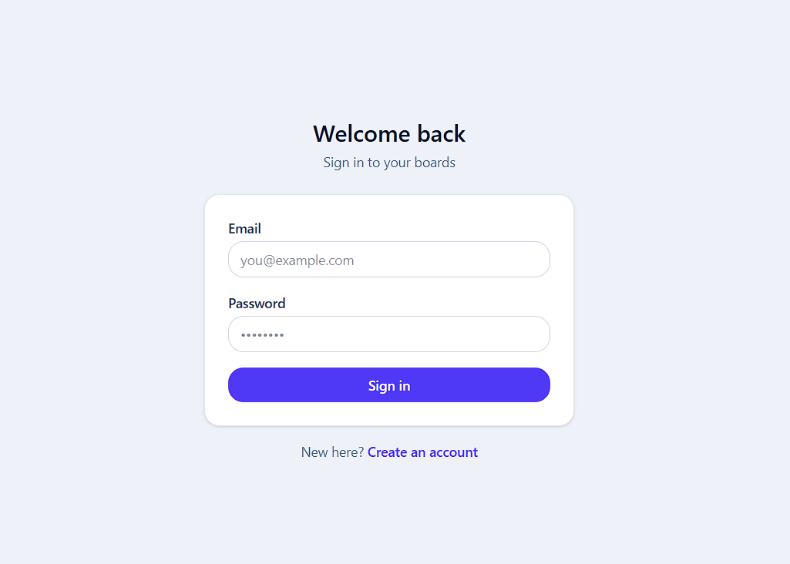
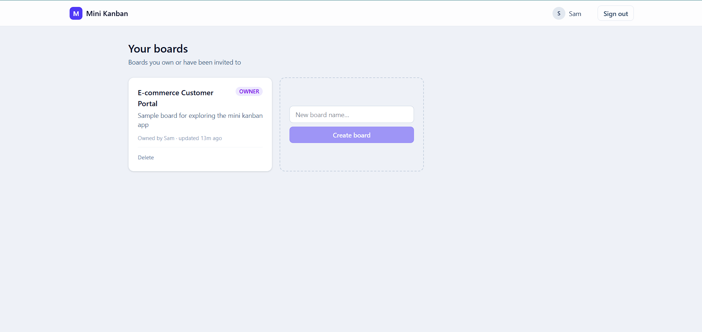
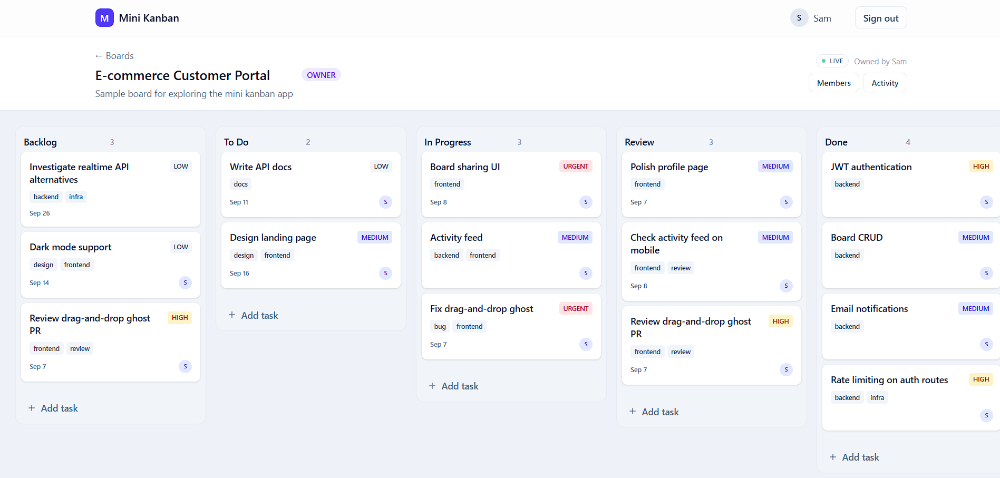
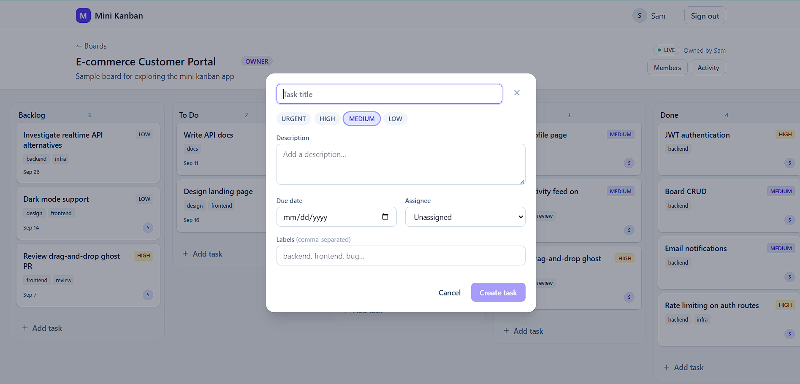
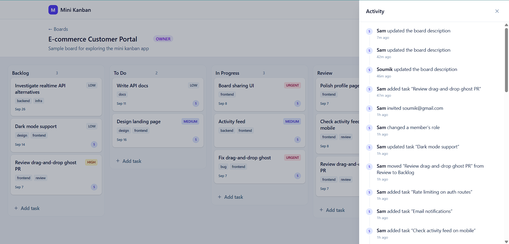
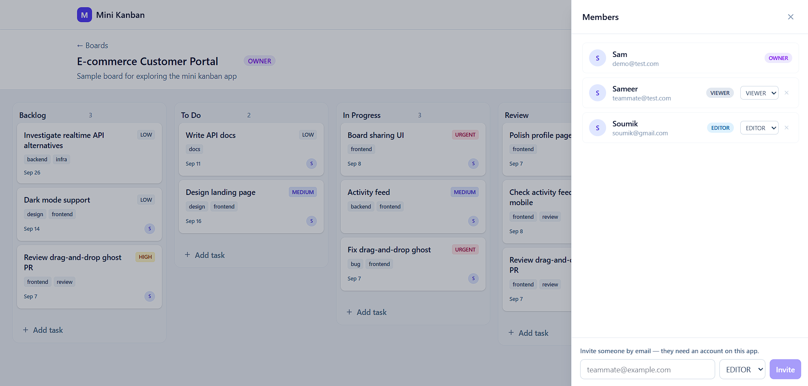

# Mini Kanban Board

[](https://github.com/soumik171/Mini-Kanban-Board/actions/workflows/ci.yml)

A collaborative kanban app for organizing work across boards, columns, and tasks. Built with a Next.js frontend and an Express API backend, with PostgreSQL for storage through Prisma.

## Screenshots

| Login                                      | Board Dashboard                                                     |
| ------------------------------------------ | ------------------------------------------------------------------- |
|  |  |

| Main Dashboard                                     | Add Task                                             |
| -------------------------------------------------- | ---------------------------------------------------- |
|  |  |

| Activity Panel                                               | Members                                            |
| ------------------------------------------------------------ | -------------------------------------------------- |
|  |  |

## What it does

The app lets you create boards with customizable columns, drag and drop tasks between them, invite teammates with different permission levels, and track every change through an activity feed. It supports real-time updates so everyone on a board sees changes as they happen.

Two demo accounts come pre-seeded:

- **demo@test.com** / `demo-password-1` — board owner
- **teammate@test.com** / `demo-password-1` — editor access

## Features

### Task Features

- **Comments on tasks** — threaded comments attached to each task for discussion and updates.
- **Task priorities** — assign a priority level to each task: LOW, MEDIUM, HIGH, or URGENT.
- **Task labels/tags** — organize tasks with customizable labels for quick filtering and grouping.
- **Task due dates** — set deadlines on tasks, with overdue indicators that highlight past-due items.
- **Task assignments** — assign tasks to board members so ownership and responsibility are clear.

### Collaboration

- **Board sharing by email invitation** — invite teammates to a board by email, with different permission levels (owner, editor, viewer).

### Activity & Comments

- **Activity feed pagination** — the activity feed uses cursor-based pagination to efficiently load history as the feed grows.

## Tech stack

**Frontend** — Next.js 16, React 19, Tailwind CSS 4, TypeScript. Uses HTML5 drag and drop with optimistic updates.

**Backend** — Express 5, Prisma ORM, PostgreSQL 16, TypeScript. REST API with JWT authentication (access + refresh tokens), rate limiting, and CORS.

**Infrastructure** — Docker Compose for local development, with PostgreSQL in a container.

## Getting started

### Prerequisites

- Node.js 22+
- npm
- Docker (optional, for database)

### Quick start

```bash
git clone https://github.com/soumik171/Mini-Kanban-Board.git
cd Mini-Kanban-Board
docker compose up
```

This starts PostgreSQL and the backend API. In a second terminal:

```bash
cd frontend
npm run dev
```

Open http://localhost:3000.

### Without Docker

If you have PostgreSQL running separately:

```bash
# Backend
cd backend
npm install
npx prisma generate
npx prisma migrate deploy
npm run db:seed
npm run dev

# Frontend (separate terminal)
cd frontend
npm install
npm run dev
```

Set `DATABASE_URL` in your backend environment to point at your PostgreSQL instance.

## API

The backend serves JSON at `/api`. Authentication uses Bearer tokens for most requests, with a refresh cookie for token rotation.

### Auth endpoints

- `POST /api/auth/register` — create account
- `POST /api/auth/login` — sign in
- `POST /api/auth/refresh` — get new access token
- `POST /api/auth/logout` — clear session
- `GET /api/auth/me` — current user
- `GET /api/auth/stream?boardId=...` — SSE stream for live updates

### Board endpoints

- `GET /api/boards` — list boards
- `POST /api/boards` — create board
- `GET /api/boards/:id` — board detail
- `PATCH /api/boards/:id` — update board
- `DELETE /api/boards/:id` — delete board (owner only)
- `GET /api/boards/:id/members` — list members
- `POST /api/boards/:id/members` — invite/add a member
- `PATCH /api/boards/:id/members/:memberId` — update member role
- `DELETE /api/boards/:id/members/:memberId` — remove a member
- `GET /api/boards/:id/activity` — activity feed (cursor-based pagination)

### Column endpoints

- `GET /api/boards/:boardId/columns` — list columns
- `POST /api/boards/:boardId/columns` — create column
- `PATCH /api/columns/:id` — update column
- `DELETE /api/columns/:id` — delete column

### Task endpoints

- `GET /api/columns/:columnId/tasks` — list tasks in a column
- `POST /api/columns/:columnId/tasks` — create task
- `GET /api/tasks/:id` — task detail
- `PATCH /api/tasks/:id` — update task (title, description, priority, labels, due date, assignee)
- `DELETE /api/tasks/:id` — delete task
- `PATCH /api/tasks/:id/move` — move task between columns

### Comment endpoints

- `GET /api/tasks/:taskId/comments` — list comments on a task
- `POST /api/tasks/:taskId/comments` — add a comment
- `DELETE /api/comments/:id` — delete a comment

## Deployment

The project includes a `docker-compose.yml` for local use. For production, the typical setup is:

1. **Database** — Neon (PostgreSQL as a service)
2. **Backend** — Render or similar (runs the Express API)
3. **Frontend** — Vercel (hosts the Next.js app)

The frontend proxies API calls through `next.config.ts`, so the browser sees everything as same-origin.

### Environment variables

Backend (required):

- `DATABASE_URL` — PostgreSQL connection string
- `JWT_ACCESS_SECRET` — random secret for access tokens
- `JWT_REFRESH_SECRET` — random secret for refresh tokens
- `CLIENT_ORIGIN` — frontend URL for CORS

Frontend:

- `BACKEND_URL` — backend API URL (for production)

## Development

From the backend directory:

- `npm run typecheck` — type checking
- `npm run lint` — ESLint
- `npm run test` — Vitest tests
- `npm run dev` — dev server with hot reload

From the frontend directory:

- `npm run dev` — Next.js dev server
- `npm run build` — production build
- `npm run lint` — ESLint

## Project structure

```
/
├── backend/
│   ├── src/              # Express API
│   ├── prisma/           # Schema and migrations
│   └── Dockerfile
├── frontend/
│   ├── src/              # Next.js app
│   ├── public/           # Static assets
│   └── next.config.ts
├── docker-compose.yml
└── README.md
```

## License

MIT License

Copyright (c) 2026 Soumik

The above copyright notice and this permission notice shall be included in all
copies or substantial portions of the Software.
